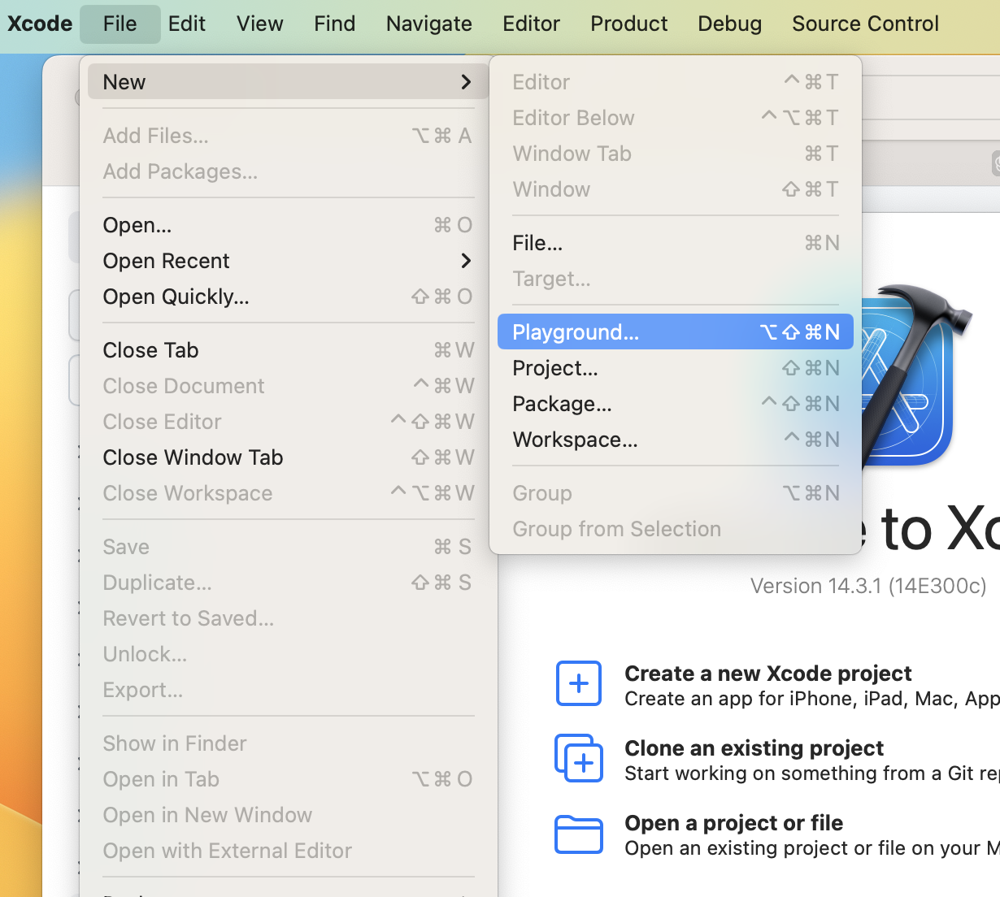
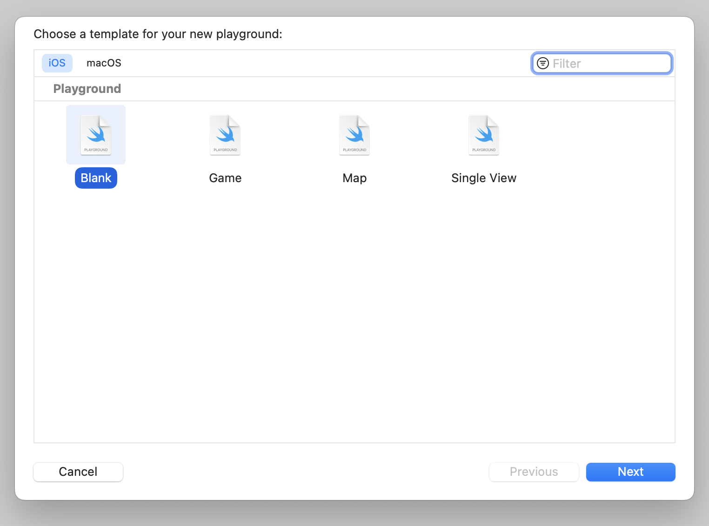
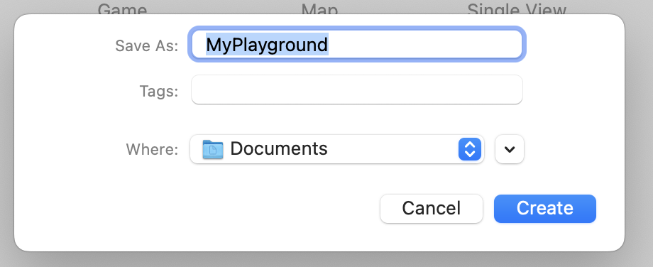

# Introducción a Xcode y el Uso de Playground

## ¿Qué es Xcode?

**Xcode** es un entorno de desarrollo integrado (IDE, por sus siglas en inglés) creado por Apple. Está diseñado para desarrollar aplicaciones para los sistemas operativos de Apple, como iOS, macOS, watchOS y tvOS. Xcode es ampliamente utilizado por desarrolladores para crear aplicaciones tanto para dispositivos móviles como para computadoras de escritorio de Apple.

## Características de Xcode:

- **Editor de Código**: Proporciona un editor de código poderoso con resaltado de sintaxis y autocompletado para múltiples lenguajes de programación, como Swift y Objective-C.
- **Interfaz Gráfica de Usuario (GUI) Builder**: Xcode incluye una herramienta llamada **Interface Builder** que permite diseñar las interfaces de usuario visualmente, arrastrando y soltando elementos.
- **Depuración Avanzada**: Ofrece herramientas de depuración como puntos de interrupción, seguimiento de variables, inspección de memoria y más, para facilitar la identificación y corrección de errores en el código.
- **Simuladores y Dispositivos Conectados**: Permite probar aplicaciones en simuladores de diferentes dispositivos iOS y macOS, así como en dispositivos físicos conectados.
- **Gestión de Recursos**: Facilita la gestión de recursos, como imágenes, sonidos y archivos de configuración, dentro del proyecto.
- **Integración con Git**: Xcode tiene integración nativa con el sistema de control de versiones Git, lo que facilita la colaboración en proyectos.

## Playground dentro de Xcode:

Un **Playground** es una característica de Xcode que permite escribir y probar código Swift de manera interactiva, lo que lo convierte en un entorno ideal para aprender, experimentar y prototipar. Los Playgrounds son particularmente útiles para comprender cómo funciona el código en tiempo real y cómo cambian los valores a medida que se ejecuta.

### Ventajas de los Playgrounds:

1. **Interactividad**: Los Playgrounds permiten ver los resultados de código de manera inmediata, lo que facilita la comprensión de conceptos y la resolución de problemas.
2. **Aprendizaje Rápido**: Son ideales para principiantes que desean aprender Swift y otros conceptos de programación de manera gradual y práctica.
3. **Prototipado Rápido**: Los desarrolladores pueden probar ideas y prototipos de manera rápida sin la necesidad de crear una aplicación completa.

### Crear un Playground:

1. Abre Xcode.
2. Selecciona "File" (Archivo) en la barra de menú.
3. Elige "New" (Nuevo) y luego "Playground".
4. Escoge la plataforma (iOS, macOS, watchOS, tvOS) en la que deseas trabajar.
5. Dale un nombre al Playground y selecciona la ubicación donde deseas guardarlo.

### Uso Básico:

1. **Editor de Código**: Escribe tu código Swift en el área de edición en la parte central del Playground.
2. **Resultados en Tiempo Real**: Observa los resultados, como valores de variables o salidas de función, en la barra lateral derecha a medida que escribes el código.
3. **Área de Consola**: Puedes imprimir valores en la consola usando `print()` y ver los resultados en la parte inferior del Playground.
4. **Experimentación**: Modifica el código y observa cómo cambian los resultados de manera inmediata.
5. **Documentación Rápida**: Puedes obtener información sobre clases y métodos escribiendo su nombre seguido de `.`, y luego presionando "Option" y haciendo clic en el elemento.

## Conclusión

Xcode es una herramienta esencial para desarrollar aplicaciones en los ecosistemas de Apple, y los Playgrounds dentro de Xcode ofrecen una manera interactiva y rápida de aprender, experimentar y prototipar código Swift. Ya sea que seas un principiante en programación o un desarrollador experimentado, Xcode y los Playgrounds pueden ser tus aliados para crear aplicaciones y comprender conceptos de manera más efectiva.

[<< Anterior](../IntroduccionMacOS) | [Siguiente >>](../HolaMundo)
