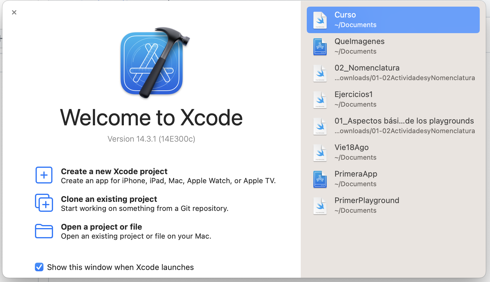
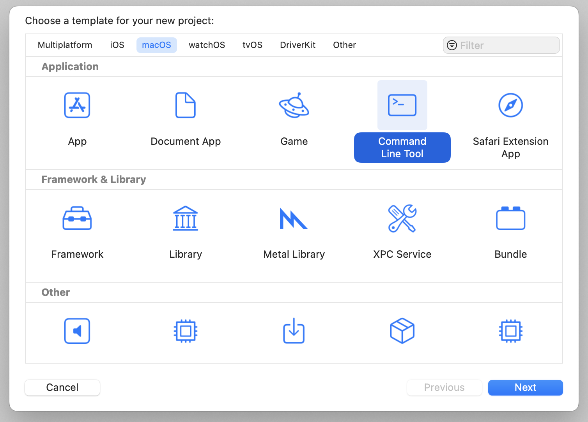
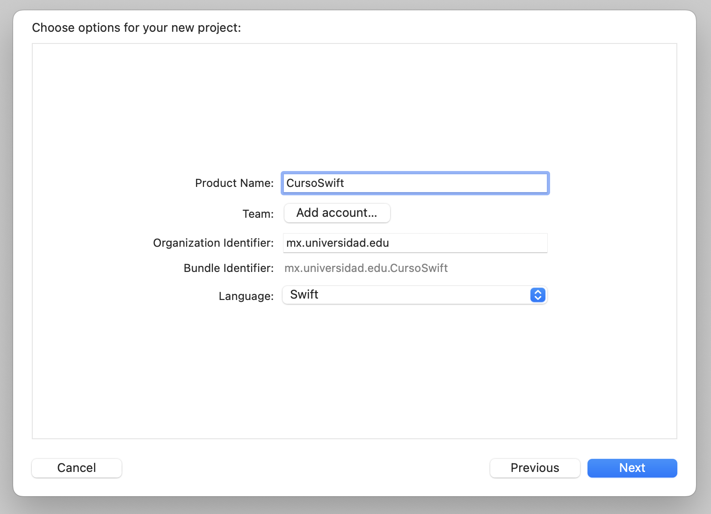
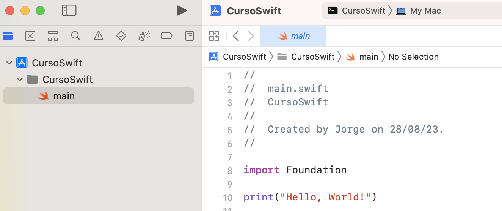
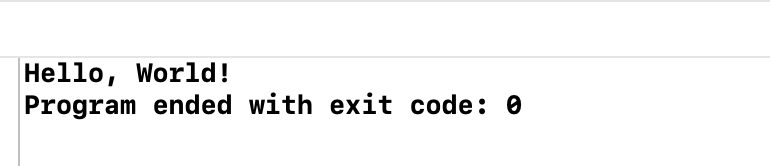

# Aplicación de Consola con Xcode

1. **Abre Xcode:**
   Abre Xcode en tu Mac desde la carpeta "Aplicaciones" o usando Spotlight.

2. **Crea un nuevo proyecto:**
   - Selecciona "Crear un nuevo Xcode" en la ventana de inicio.
   - En la ventana de plantillas, elige "Aplicación" en la parte superior.
   - En la sección "iOS", selecciona "Line Command Tool".
   - Haz clic en "Siguiente".

3. **Configura el proyecto:**
   - **Nombre y ubicación:** Asigna un nombre y elige la ubicación del proyecto.
   - **Equipo:** Selecciona tu equipo de desarrollo o "None".
   - **Organización:** Ingresa el nombre de tu organización (opcional).
   - **Lenguaje:** Elige "Swift".

4. **Crear el código de la aplicación:**
   - Abre el archivo "main.swift" en el panel de navegación.
   - Escribe el código de tu aplicación en el archivo "main.swift".

     
5. **Escribe el código:**
   - Abre el archivo "main.swift" (Swift) o el archivo adecuado (C++) en el panel de navegación.
   - Escribe el código de tu aplicación en el archivo correspondiente.

6. **Ejecuta la aplicación:**
   - Haz clic en el botón de "Ejecutar" (triángulo en la parte superior) en la barra de herramientas de Xcode.
   - Esto compilará y ejecutará tu aplicación de consola.

[<< Anterior](../EnumyStruct) | [Siguiente >>](../MiniProyectoXcode)
